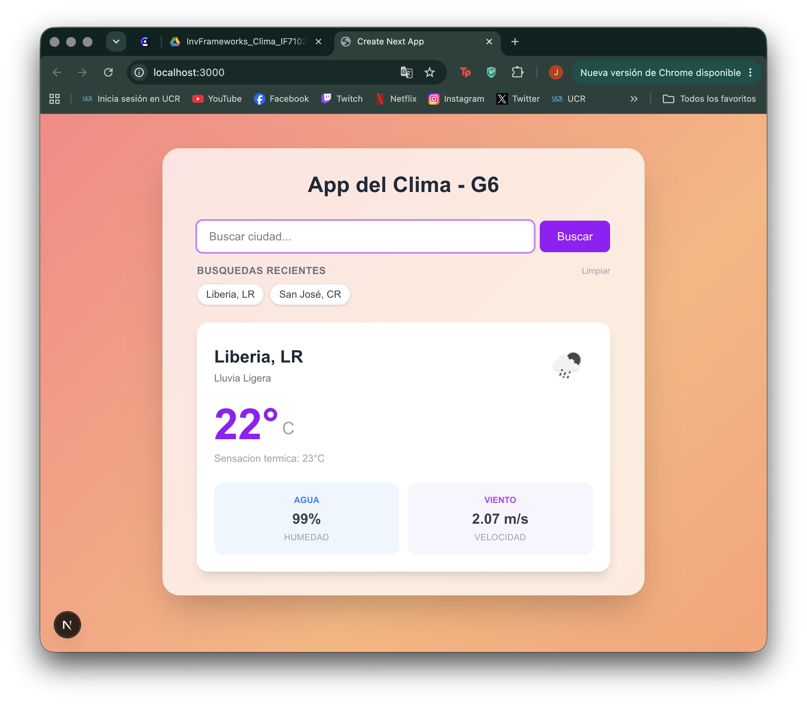

# ⛅ App del Clima - Grupo 6 (G6)

Una aplicación web moderna y responsiva para consultar el clima en tiempo real, construida con un diseño premium *glassmorphism* que optimiza la legibilidad del texto sobre un fondo de gradiente animado.

---

## 1. Framework Usado

El proyecto está construido utilizando **[Next.js 16.2](https://nextjs.org/)** (con **React 19**). 
- **Razones del uso:** Permite el uso de rutas API en el servidor para realizar peticiones seguras sin exponer credenciales sensibles en el navegador del usuario, además de proveer soporte nativo y optimizado para despliegues rápidos en Vercel.
- **Herramientas de estilizado:** **Tailwind CSS v4** para un sistema de diseño moderno con variables CSS puras y **TypeScript 5** para garantizar la seguridad de tipado en toda la base de código.

---

## 2. Setup (Instalación y Configuración desde Cero)

Sigue estos pasos paso a paso si es tu primera vez configurando o corriendo este tipo de proyectos:

### Paso 1: Instalar Node.js
Esta aplicación requiere Node.js para ejecutarse.
1. Ve a la página oficial de [Node.js (https://nodejs.org/)](https://nodejs.org/) y descarga la versión **LTS** recomendada para tu sistema operativo.
2. Ejecuta el instalador descargado y sigue las instrucciones en pantalla.
3. Para comprobar que se instaló correctamente, abre la terminal de tu computadora y ejecuta:
   ```bash
   node -v
   npm -v
   ```
   *(Deberían aparecerte números de versión en la pantalla, por ejemplo: `v20.x.x` y `10.x.x`).*

### Paso 2: Descargar el Código del Proyecto
Puedes obtener el código de dos maneras:
- **Opción A (Recomendada si usas Git):** Abre tu terminal en la carpeta donde guardas tus proyectos y clona el repositorio corriendo:
  ```bash
  git clone https://github.com/Dann233/grupo6-weather-nextjs16.git
  ```
- **Opción B:** Descarga el proyecto en formato `.zip` desde el botón verde "Code" en GitHub, descomprímelo en tu computadora y cambia el nombre de la carpeta a `grupo6-weather-nextjs16`.

### Paso 3: Abrir la Terminal en la Carpeta del Proyecto
1. Si usas **Visual Studio Code**, ve a `Archivo > Abrir carpeta...` y selecciona la carpeta descomprimida o clonada.
2. Abre una terminal integrada de VS Code yendo al menú superior: `Terminal > Nueva terminal`.
3. Asegúrate de estar dentro de la subcarpeta donde está la aplicación de Next.js (`g6-weather-nextjs`). Para entrar, escribe esto en la terminal y presiona Enter:
   ```bash
   cd g6-weather-nextjs
   ```

### Paso 4: Instalar las Dependencias
Una vez posicionado dentro de la carpeta `g6-weather-nextjs`, ejecuta el siguiente comando para descargar todos los paquetes necesarios del proyecto (como React y Next.js):
```bash
npm install
```
*(Esto creará automáticamente una carpeta llamada `node_modules` en tu proyecto).*

### Paso 5: Configurar la API Key
*Antes de correr la aplicación, debes configurar tu clave de OpenWeatherMap. Ve a la **Sección 6** de esta guía para ver cómo crear tu archivo `.env.local`.*

### Paso 6: Iniciar el Servidor de Desarrollo
Una vez configurado tu archivo `.env.local`, ejecuta el siguiente comando en la terminal:
```bash
npm run dev
```
Este comando iniciará el servidor web local. Verás un mensaje que dice que la aplicación está lista en `http://localhost:3000`.

### Paso 7: Abrir la Aplicación
Abre tu navegador de internet favorito (Chrome, Safari, Edge, etc.) e ingresa a la siguiente dirección:
👉 **[http://localhost:3000](http://localhost:3000)**

---

## 3. Conceptos Clave

- **Rutas API Seguras (BFF - Backend For Frontend):** Toda consulta a la API de OpenWeatherMap se enruta a través de `/api/weather` y `/api/geocode`. Esto protege la API Key, evitando que se exponga en el código del lado del cliente.
- **Mecanismo de Debounce (300ms):** En el componente de búsqueda aproximada, las sugerencias de ciudades esperan a que el usuario deje de escribir durante 300ms antes de disparar la consulta HTTP, reduciendo drásticamente las peticiones innecesarias.
- **Hook Personalizado (`useSearchHistory`):** Lógica encapsulada para persistir y recuperar el historial de búsquedas del usuario de forma dinámica a través de la API de `localStorage`.
- **Efecto Glassmorphism:** Implementación visual a través de filtros de fondo (`backdrop-blur-md`) combinados con una capa de color blanca translúcida (`bg-white/75`) y un borde suave, asegurando que todos los textos mantengan un alto contraste a pesar del fondo animado.
- **Animaciones por Hardware:** Uso de animaciones basadas en `@keyframes` de CSS para la transición fluida de colores en el fondo sin sobrecargar el hilo principal del procesador.

---

## 4. Pros y Contras

### Pros
* **Seguridad de Credenciales:** Las API Keys están 100% protegidas en variables de entorno del servidor.
* **Excelente Legibilidad:** El contenedor glassmorphism resuelve el contraste sobre fondos muy coloridos o móviles.
* **Eficiencia en Red:** El autocompletado optimizado con *debounce* reduce el tráfico de red de la aplicación.
* **Carga Instantánea:** Compilado optimizado gracias al nuevo compilador Turbopack integrado en Next.js 16.

### Contras
* **Dependencia de APIs Externas:** Al usar el geocodificador gratuito de OpenWeatherMap, la velocidad de autocompletado depende directamente de la latencia de sus servidores.
* **Tiempo de Activación de API Key:** Las nuevas llaves de OpenWeatherMap pueden tardar hasta 2 horas en activarse globalmente, lo cual puede causar confusión inicial al configurar el entorno.

---

## 5. Características Implementadas

1. **Búsqueda Aproximada interactiva** con listado inteligente de sugerencias al escribir (mínimo 2 caracteres).
2. **Tarjeta de Información del Clima Completa** que detalla: Ciudad, País, Estado de clima (con ícono descriptivo), Temperatura actual, Sensación térmica, Porcentaje de humedad, y Velocidad del viento.
3. **Historial persistente de búsquedas recientes** en burbujas dinámicas con opción de limpieza de datos.
4. **Fondo de gradiente animado** inspirado en un atardecer que cambia sus tonalidades de forma continua.
5. **Diseño Responsivo adaptado** a móviles, tabletas y ordenadores portátiles.

---

## 6. Cómo Configurar la API Key Localmente

Para que las consultas al clima funcionen localmente, debes indicarle tu clave de OpenWeatherMap a Next.js:

1. Crea un archivo con nombre **`.env.local`** en la carpeta raíz del proyecto (`g6-weather-nextjs`).
2. Agrega la clave obtenida de OpenWeatherMap en la siguiente variable de entorno:
   ```env
   OWM_API_KEY=tu_api_key_aqui
   ```
3. Guarda el archivo y reinicia tu terminal (`npm run dev`) para aplicar los cambios.

---

## 7. Capturas de Pantalla

A continuación se presentan capturas del funcionamiento de la aplicación en tiempo real:

| Vista Principal (Inicial) | Búsqueda y Autocompletado |
| :---: | :---: |
|  |  |

| Vista Tablet / Historial | Vista Móvil Responsiva |
| :---: | :---: |
|  |  |

---

## 8. URL de la Demo

La aplicación se encuentra desplegada y lista para usar en producción:

URL aqui

---

## 9. Fuentes de Información y Referencias Técnicas

Las referencias y fuentes de información consultadas para la justificación teórica y técnica del proyecto se encuentran detalladas en el archivo [REFERENCIAS.md](./REFERENCIAS.md).
