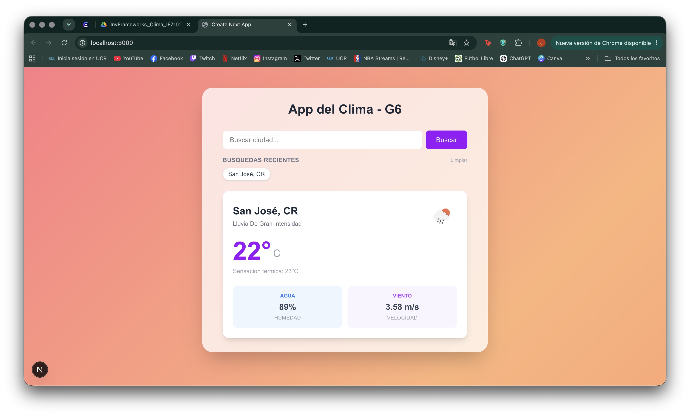
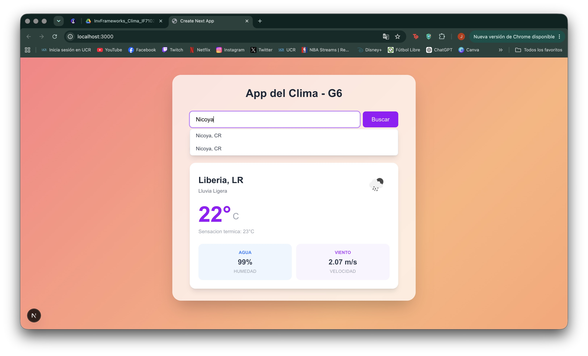
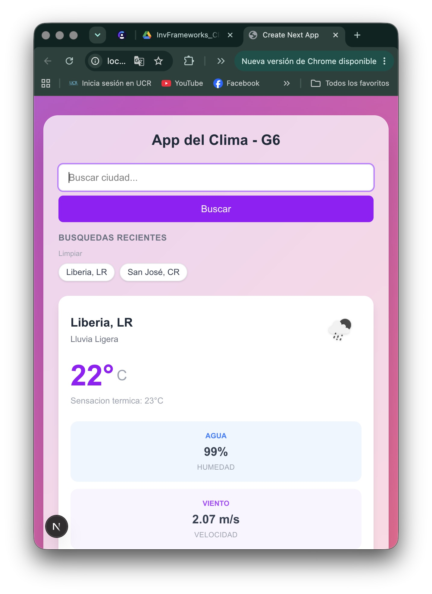

# ⛅ App del Clima - Grupo 6 (G6)

Una aplicación web moderna y responsiva para consultar el clima en tiempo real, construida con un diseño premium *glassmorphism* que optimiza la legibilidad del texto sobre un fondo de gradiente animado.

---

## 1. Framework Usado

El proyecto está construido utilizando **[Next.js 16.2](https://nextjs.org/)** (con **React 19**). 
- **Razones del uso:** Permite el uso de rutas API en el servidor para realizar peticiones seguras sin exponer credenciales sensibles en el navegador del usuario, además de proveer soporte nativo y optimizado para despliegues rápidos en Vercel.
- **Herramientas de estilizado:** **Tailwind CSS v4** para un sistema de diseño moderno con variables CSS puras y **TypeScript 5** para garantizar la seguridad de tipado en toda la base de código.

---

## 2. Setup (Instalación y Configuración Local)

Para clonar e iniciar el servidor de desarrollo localmente:

1. **Instalar dependencias de Node.js:**
   ```bash
   npm install
   ```

2. **Iniciar el servidor de desarrollo:**
   ```bash
   npm run dev
   ```

3. **Acceder a la aplicación:**
   Abre [http://localhost:3000](http://localhost:3000) en tu navegador web.

---

## 3. Conceptos Clave

- **Rutas API Seguras (BFF - Backend For Frontend):** Toda consulta a la API de OpenWeatherMap se enruta a través de `/api/weather` y `/api/geocode`. Esto protege la API Key, evitando que se exponga en el código del lado del cliente.
- **Mecanismo de Debounce (300ms):** En el componente de búsqueda aproximada, las sugerencias de ciudades esperan a que el usuario deje de escribir durante 300ms antes de disparar la consulta HTTP, reduciendo drásticamente las peticiones innecesarias.
- **Hook Personalizado (`useSearchHistory`):** Lógica encapsulada para persistir y recuperar el historial de búsquedas del usuario de forma dinámica a través de la API de `localStorage`.
- **Efecto Glassmorphism:** Implementación visual a través de filtros de fondo (`backdrop-blur-md`) combinados con una capa de color blanca translúcida (`bg-white/75`) y un borde suave, asegurando que todos los textos mantengan un alto contraste a pesar del fondo animado.
- **Animaciones por Hardware:** Uso de animaciones basadas en `@keyframes` de CSS para la transición fluida de colores en el fondo sin sobrecargar el hilo principal del procesador.

---

## 4. Pros y Contras

### Pros
* **Seguridad de Credenciales:** Las API Keys están 100% protegidas en variables de entorno del servidor.
* **Excelente Legibilidad:** El contenedor glassmorphism resuelve el contraste sobre fondos muy coloridos o móviles.
* **Eficiencia en Red:** El autocompletado optimizado con *debounce* reduce el tráfico de red de la aplicación.
* **Carga Instantánea:** Compilado optimizado gracias al nuevo compilador Turbopack integrado en Next.js 16.

### Contras
* **Dependencia de APIs Externas:** Al usar el geocodificador gratuito de OpenWeatherMap, la velocidad de autocompletado depende directamente de la latencia de sus servidores.
* **Tiempo de Activación de API Key:** Las nuevas llaves de OpenWeatherMap pueden tardar hasta 2 horas en activarse globalmente, lo cual puede causar confusión inicial al configurar el entorno.

---

## 5. Características Implementadas

1. **Búsqueda Aproximada interactiva** con listado inteligente de sugerencias al escribir (mínimo 2 caracteres).
2. **Tarjeta de Información del Clima Completa** que detalla: Ciudad, País, Estado de clima (con ícono descriptivo), Temperatura actual, Sensación térmica, Porcentaje de humedad, y Velocidad del viento.
3. **Historial persistente de búsquedas recientes** en burbujas dinámicas con opción de limpieza de datos.
4. **Fondo de gradiente animado** inspirado en un atardecer que cambia sus tonalidades de forma continua.
5. **Diseño Responsivo adaptado** a móviles, tabletas y ordenadores portátiles.

---

## 6. Cómo Configurar la API Key Localmente

Para que las consultas al clima funcionen localmente, debes indicarle tu clave de OpenWeatherMap a Next.js:

1. Crea un archivo con nombre **`.env.local`** en la carpeta raíz del proyecto (`g6-weather-nextjs`).
2. Agrega la clave obtenida de OpenWeatherMap en la siguiente variable de entorno:
   ```env
   OWM_API_KEY=tu_api_key_aqui
   ```
3. Guarda el archivo y reinicia tu terminal (`npm run dev`) para aplicar los cambios.

---

## 7. Capturas de Pantalla

A continuación se presentan capturas del funcionamiento de la aplicación en tiempo real:

| Vista Principal (Inicial) | Búsqueda y Autocompletado |
| :---: | :---: |
|  |  |

| Vista Tablet / Historial | Vista Móvil Responsiva |
| :---: | :---: |
|  |  |

---

## 8. URL de la Demo

La aplicación se encuentra desplegada y lista para usar en producción:

🚀 **[Ver Demo en Vercel](https://grupo6-weather-nextjs16.vercel.app/)** *(Nota: Reemplaza este enlace con la URL final de tu proyecto tras realizar el deployment en Vercel).*

---

## 📚 Fuentes de Información y Referencias Técnicas

1. **Next.js 16 Documentation (Routing y API Routes):** [https://nextjs.org/docs](https://nextjs.org/docs)
2. **React 19.0 Hooks & State Management:** [https://react.dev/reference/react](https://react.dev/reference/react)
3. **Tailwind CSS v4.0 Specification:** [https://tailwindcss.com/docs](https://tailwindcss.com/docs)
4. **OpenWeatherMap Current Weather API:** [https://openweathermap.org/current](https://openweathermap.org/current)
5. **OpenWeatherMap Geocoding API:** [https://openweathermap.org/api/geocoding-api](https://openweathermap.org/api/geocoding-api)
6. **Vercel Project Environment Variables Guide:** [https://vercel.com/docs/projects/environment-variables](https://vercel.com/docs/projects/environment-variables)
7. **MDN Web Docs - Fetch API:** [https://developer.mozilla.org/es/docs/Web/API/Fetch_API](https://developer.mozilla.org/es/docs/Web/API/Fetch_API)
8. **TypeScript Compiler & Language Handbook:** [https://www.typescriptlang.org/docs/](https://www.typescriptlang.org/docs/)
9. **W3C CSS Backgrounds and Borders Module Level 3:** [https://www.w3.org/TR/css-backgrounds-3/](https://www.w3.org/TR/css-backgrounds-3/)
